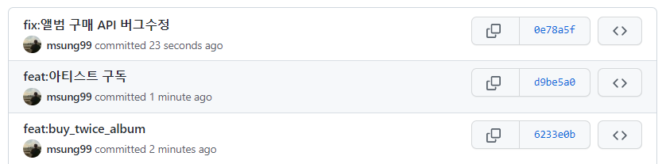
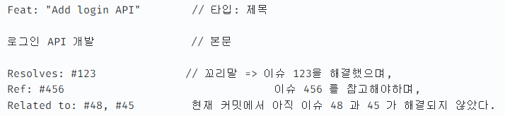

# 푸바오: 푸른 바다로 오세요

<!-- 필수 항목 -->

## 카테고리

| Application                          | Domain                                | Language                      | Framework                               |
| ------------------------------------ | ------------------------------------- | ----------------------------- | --------------------------------------- |
| :black_square_button: Desktop Web    | :white_check_mark: AI                 | :white_check_mark: JavaScript | :black_square_button: Vue.js            |
| :black_square_button: Mobile Web     | :black_square_button: Big Data        | :white_check_mark: TypeScript | :white_check_mark: React                |
| :black_square_button: Responsive Web | :black_square_button: Blockchain      | :black_square_button: C/C++   | :black_square_button: Angular           |
| :white_check_mark: Android App       | :white_check_mark: IoT                | :black_square_button: C#      | :white_check_mark: Node.js              |
| :black_square_button: iOS App        | :black_square_button: AR/VR/Metaverse | :white_check_mark: Python     | :white_check_mark: Flask/Django         |
| :white_check_mark: Desktop App       | :black_square_button: Game            | :black_square_button: Java    | :black_square_button: Spring/Springboot |
|                                      |                                       | :black_square_button: Kotlin  |                                         |

<!-- 필수 항목 -->

## 프로젝트 소개

- 프로젝트명: 푸바오
- 서비스 특징: 20, 30대 바다 낚시 입문자를 위한 바다 낚시 입문 가이드 앱 서비스
- 주요 기능
  - 맞춤 정보 제공
  - AI 이미지 인식
  - 나만의 도감
  - 어항
- 주요 기술
  - 어종 판별
  - 길이 측정
  - 추천 알고리즘
  - 홈 IoT
- 참조 리소스
  - Material-UI: React Component Library
- 배포 환경
  - URL: https://i10c104.p.ssafy.io/
  - 테스트 계정: ssafy@ssafy.com / ssafy1111

<!-- 자유 양식 -->

## 팀 소개

- 김지용: 팀장, 프론트엔드 개발
- 고광현: 프론트엔드 개발
- 김민영: 서기, 백엔드 개발
- 박미성: AI 모델
- 오유진: 발표, 백엔드 개발

<!-- 자유 양식 -->

## 프로젝트 상세 설명

// 개발 환경, 기술 스택, 시스템 구성도, ERD, 기능 상세 설명 등

### 개발 환경

### 서비스 화면

- AI 어종 판별 및 길이 측정

- 추천 컴포넌트 및 일정 등록

### 주요 기능

### 기술 소개

### 설계 문서

## Git Commit Convention

### Commit Message 구조

커밋 메시지는 제목/본문/꼬리말로 구성

type: Subject // 제목
body(옵션) // 본문
footer(옵션) // 꼬리말

type : 어떤 의도로 커밋했는지를 type 에 명시(ex. feat, fix, docs)

Subject : 제목. 코드 변경사항에 대한 짧은 요약

body : 긴 설명이 필요한 경우, 어떻게 작성했는지가 아닌 무엇을 왜 했는지 를 작성(부연설명 혹은 커밋이유)

footer : issue tracker ID 를 명시하고 싶은 경우에 작성

### Commit Example

### 타입(Commit Type)

- 태그(tag) + 제목(subject) 형식
- 첫 문자는 대문자
- "태그: 제목" 의 형태이며, ":" 뒤에 space 가 있음에 유의[ex) Feat: buy album api (Feat 가 태그이고, buy album api 가 제목)]

### 태그 종류

- Add : 코드나 테스트, 예제, 문서등의 추가 생성이 있는경우
- Implement : 코드가 추가된 정도보다 더 주목할만한 구현체를 완성시켰을 때
- Design : CSS 등 사용자가 UI 디자인을 변경했을 때
- Temp : 작업 중에 사정상 임시로 저장할 경우
- Docs : 문서를 수정한 경우
- Fix : 버그를 고친경우
- Style : 코드 포맷 변경, 세미콜론 누락, 코드 수정이 없는경우
- Refactor : 코드 리펙토링
- Test : 테스트 코드. 리펙토링 테스트 코드를 추가했을 때
- Rename : 파일명(or 폴더명) 을 수정한 경우
- Remove : 코드(파일) 의 삭제가 있을 때. "Clean", "Eliminate" 를 사용하기도 함
- Chore : 빌드 업무 수정, 패키지 매니저 수정
- Improve : 향상이 있는 경우. 호환성, 검증 기능, 접근성 등이 될수 있습니다.
- Move : 코드의 이동이 있는경우
- Feat : 새로운 기능을 추가하는 경우
- Updated : 계정이나 버전 업데이트가 있을 때 사용. 주로 코드보다는 문서나, 리소스, 라이브러리등에 사용합니다.
- Comment : 필요한 주석 추가 및 변경

### 제목

- 제목은 최대 50글자가 넘지 않고, 마침표 및 특수기호는 사용 금지
- 동사(원형)를 가장 앞에 두고 첫 글자는 대문자로 표기
- 제목은 개조식 구문으로 작성 --> 완전한 서술형 문장이 아니라, 간결하고 요점적인 서술을 의미.

* Fixed --> Fix
* Added --> Add
* Modified --> Modify

### 본문(Body)

- 본문은 한 줄 당 72자 내로 작성
- 본문 내용은 양에 구애받지 않고 최대한 상세히 작성
- 어떻게 변경했는지 보다 무엇을 변경했는지 또는 왜 변경했는지를 설명

### 꼬릿말(Footer)

- 꼬리말은 선택사항, 이슈 트래커 ID 작성
- "유형: #이슈 번호" 형식으로 사용
- 여러 개의 이슈 번호를 적을 때는 쉼표(,)로 구분
- 이슈 트래커 유형은 다음 중 하나를 사용

1. Fixes: 이슈 수정중 (아직 해결되지 않은 경우)
2. Resolves: 이슈를 해결했을 때 사용
3. Ref: 참고할 이슈가 있을 때 사용
4. Related to: 해당 커밋에 관련된 이슈번호 (아직 해결되지 않은 경우)
   ex) Fixes: #45 Related to: #34, #23
